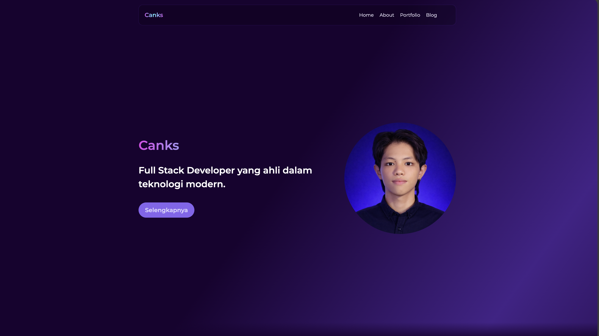

# Portfolio Full Stack - Astro Template

Selamat datang di repository **Portfolio Full Stack** saya. Project ini dibangun menggunakan **Astro** dan dirancang untuk menampilkan berbagai proyek yang pernah saya kerjakan, mulai dari aplikasi web, sistem ERP, hingga aplikasi enterprise. Portfolio ini memiliki tampilan yang modern, responsif, dan fokus pada performa serta kemudahan navigasi.

Di repository ini, kamu bisa menemukan informasi mengenai struktur project, cara menambahkan data portfolio, teknologi yang digunakan, serta contoh implementasi yang digunakan dalam pengembangan aplikasi ini.



## Daftar Isi

1. [Cara Penggunaan](#cara-penggunaan)
2. [Format Data Portfolio](#format-data-portfolio)
3. [Menambahkan Icon dengan Iconify](#menambahkan-icon-dengan-iconify)
4. [Teknologi yang Digunakan](#teknologi-yang-digunakan)
5. [Desain Figma](#desain-figma)
6. [Bug dan Permasalahan](#bug-dan-permasalahan)
7. [Halaman Utama](#halaman-utama)

## Cara Penggunaan

Untuk menambahkan proyek baru ke dalam portfolio, silakan tambahkan data proyek pada file `/src/data/portfolioData.js`.

## Format Data Portfolio

Data portfolio harus mengikuti format berikut:

```js
/**
 * @typedef PortfolioData
 * @property {string} imgSrc - URL atau path gambar proyek
 * @property {string} title - Judul card / nama proyek
 * @property {string[]} skills - Daftar teknologi yang digunakan, contoh: ['React', 'CSS', 'JavaScript']
 * @property {string} description - Deskripsi singkat proyek
 * @property {string} demoURL - URL demo aplikasi (jika ada)
 * @property {string} repoURL - URL repository, contoh: https://github.com/username/repo
 * @property {string} anim - Animasi saat card ditampilkan, contoh: fade-up, fade-right, fade-left, fade-down
 * @property {number} averageBrightness - Tingkat kecerahan background card (opsional), contoh: 0.1
 */

/**
 * @type {PortfolioData[]}
 */
export const portfolioData = [
    {
        imgSrc: 'https://dt2sdf0db8zob.cloudfront.net/wp-content/uploads/2021/06/copy-of-the-6-best-restaurant-website-templates-1.png',
        title: 'Restaurant System',
        skills: ['React', 'StyledComponents'],
        description: 'Aplikasi manajemen restoran dengan tampilan modern dan responsif.',
        demoURL: '',
        repoURL: '',
        anim: 'fade-right',
    },
    {
        imgSrc: 'https://fiverr-res.cloudinary.com/images/q_auto,f_auto/gigs/299377097/original/7eb7dcebe244fcf5ad75d92b0969fc116946bd57/create-professional-amd-responsive-wordpress-website.jpg',
        title: 'E-Commerce',
        skills: ['JavaScript', 'Bootstrap'],
        description: 'Platform e-commerce untuk pengelolaan produk, transaksi, dan pelanggan.',
        demoURL: '',
        repoURL: '',
        anim: 'fade-up',
        averageBrightness: 0.1,
    },
    // Tambahkan data portfolio lainnya di sini
];

const skillIcons = {
    JavaScript: 'skill-icons:javascript',
    React: 'skill-icons:react-dark',
    Astro: 'skill-icons:astro',
    CSS: 'skill-icons:css',
    Sass: 'skill-icons:sass',
    StyledComponents: 'skill-icons:styledcomponents',
    Bootstrap: 'skill-icons:bootstrap',
    Tailwind: 'skill-icons:tailwindcss-dark',
};

/**
 * @description Mengubah data portfolio dengan menambahkan icon pada setiap skill
 */
export const getPortfolioData = portfolioData.map((item) => ({
    ...item,
    skills: item.skills.map((skill) => skillIcons[skill]),
}));
```

> [!NOTE]
> Untuk icon skill, kamu bisa menggunakan library dari Garrux: [https://github.com/Garruxx/ascii-icons](https://github.com/Garruxx/ascii-icons)

Data ini selanjutnya akan dikirim ke komponen portfolio sebagai props untuk ditampilkan di halaman portfolio.

## Menambahkan Icon dengan Iconify

Project ini menggunakan **Iconify** untuk menampilkan icon. Untuk menambahkan icon baru, gunakan atribut `icon`.

### Contoh

Untuk menampilkan icon React:

```html
<iconify-icon icon="logos:react" width="27" height="27"></iconify-icon>
```

Pada file `data.js`, tentukan identifier icon seperti berikut:

```js
{
    title: "React",
    link: "https://reactjs.org/",
    icon: "logos:react"
}
```

### Menambahkan Script Iconify

Tambahkan script Iconify ke dalam bagian `<head>` pada project kamu:

```html
<head>
    <script src="https://code.iconify.design/iconify-icon/2.1.0/iconify-icon.min.js"></script>
</head>
```

Setelah script ini ditambahkan, kamu sudah bisa menggunakan berbagai icon dari Iconify dengan menentukan identifier icon yang sesuai.

## Teknologi yang Digunakan

Template portfolio ini menggunakan beberapa teknologi modern untuk menghasilkan tampilan yang responsif, ringan, dan menarik secara visual:

- **Astro**: Static site builder modern yang memungkinkan penggunaan berbagai framework seperti React, Vue, dan Svelte, serta dioptimalkan untuk performa dengan JavaScript yang minimal.
- **React**: Library JavaScript untuk membangun antarmuka pengguna berbasis komponen yang dapat digunakan kembali.
- **Tailwind CSS**: Framework CSS berbasis utility yang memungkinkan styling langsung di dalam markup dengan fleksibilitas dan kontrol penuh.
- **Styled Components**: Library untuk React yang memungkinkan penggunaan styling pada level komponen menggunakan tagged template literals.
- **Iconify**: Library icon lengkap yang menyediakan ribuan icon dari berbagai koleksi dengan satu format penulisan yang konsisten.

## Desain Figma

Kamu dapat melihat dan mengedit desain template ini melalui Figma. Berikut adalah tautan desain Figma yang digunakan:

[Link Desain Figma](https://www.figma.com/design/15EteAKw8d0QCNCucw5lft/mi-primer-blog?node-id=200-643&t=hbUqn1hqSfLcfI92-0)

## Bug dan Permasalahan

Jika kamu menemukan bug atau mengalami kendala saat menggunakan project ini, silakan laporkan melalui halaman Issues pada repository GitHub project ini.

## Halaman Utama

Untuk informasi lebih lengkap dan dokumentasi tambahan, silakan kunjungi halaman utama repository ini di GitHub.

---

Selamat menggunakan dan mengembangkan portfolio ini!  
Jika ada pertanyaan atau ingin berdiskusi lebih lanjut, jangan ragu untuk menghubungi saya.
